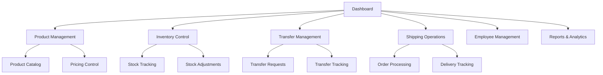

# Warehouse Management System - Database Design

## 1. Product Overview
A comprehensive warehouse management system that handles multi-location inventory, product pricing, employee management, shipping operations, and inter-warehouse transfers.
- Manages products with wholesale pricing and real-time inventory tracking across multiple warehouse locations
- Provides role-based employee access control and comprehensive shipping/logistics management
- Enables seamless inter-warehouse product transfers and complete order fulfillment workflows

## 2. Key Features

1. **Multi-Warehouse Support**: Track inventory across multiple warehouse locations
2. **Product Variants**: Support for product variations with individual pricing and stock levels
3. **Real-time Inventory**: Track stock levels, movements, and transfers between warehouses
4. **Employee Management**: Role-based access control for different employee types
5. **Order Processing**: Complete order lifecycle from creation to delivery with approval workflow
6. **Order Approval System**: Every order requires admin or staff approval before processing
7. **Multiple Customer Addresses**: Support for customers with multiple retail locations or addresses
8. **Supplier Management**: Track suppliers, purchase orders, and receiving
9. **Customer Management**: Manage customer information and order history
10. **Audit Trail**: Track all inventory movements and changes
11. **Pricing Management**: Support for both retail and wholesale pricing at variant level

## 3. Core Features

### 3.1 User Roles
| Role | Registration Method | Core Permissions |
|------|---------------------|------------------|
| Warehouse Manager | Admin assignment | Full warehouse operations, inventory management, employee oversight |
| Inventory Clerk | Manager assignment | Product management, stock updates, transfer operations |
| Shipping Coordinator | Manager assignment | Order fulfillment, shipping management, logistics coordination |
| System Administrator | System-level access | User management, system configuration, cross-warehouse oversight |

### 3.2 Feature Module
Our warehouse management system consists of the following main pages:
1. **Dashboard**: Real-time inventory overview, low stock alerts, pending transfers, shipping status
2. **Product Management**: Product catalog, pricing management, category organization, supplier information
3. **Inventory Control**: Stock levels, warehouse locations, inventory movements, stock adjustments
4. **Transfer Management**: Inter-warehouse transfers, transfer requests, tracking, approval workflows
5. **Shipping Operations**: Order processing, shipping labels, carrier management, delivery tracking
6. **Employee Management**: Staff roles, permissions, warehouse assignments, activity logs
7. **Reports & Analytics**: Inventory reports, transfer history, shipping analytics, performance metrics

### 3.3 Page Details
| Page Name | Module Name | Feature description |
|-----------|-------------|---------------------|
| Dashboard | Inventory Overview | Display real-time stock levels across all warehouses, low stock alerts, pending operations |
| Dashboard | Transfer Status | Show active transfers, pending approvals, transfer completion rates |
| Dashboard | Shipping Summary | Track outbound shipments, delivery status, shipping performance metrics |
| Product Management | Product Catalog | Create, edit, delete products with SKU, descriptions, categories, wholesale prices |
| Product Management | Pricing Control | Manage wholesale prices, bulk pricing, price history, supplier costs |
| Product Management | Supplier Management | Maintain supplier information, contact details, product associations |
| Inventory Control | Stock Tracking | Real-time inventory levels, location tracking, stock movements |
| Inventory Control | Stock Adjustments | Manual stock corrections, cycle counting, inventory reconciliation |
| Inventory Control | Location Management | Warehouse zones, bin locations, storage capacity management |
| Transfer Management | Transfer Requests | Create transfer requests between warehouses, approval workflows |
| Transfer Management | Transfer Tracking | Monitor transfer status, shipping details, receipt confirmation |
| Transfer Management | Transfer History | Complete transfer logs, performance analytics, audit trails |
| Shipping Operations | Order Processing | Process customer orders, pick lists, packing slips |
| Shipping Operations | Carrier Management | Shipping carrier setup, rate management, service options |
| Shipping Operations | Delivery Tracking | Track shipments, delivery confirmation, customer notifications |
| Employee Management | User Roles | Assign warehouse roles, permission management, access control |
| Employee Management | Activity Logs | Track user actions, inventory changes, system access logs |
| Reports & Analytics | Inventory Reports | Stock reports, turnover analysis, valuation reports |
| Reports & Analytics | Performance Metrics | Transfer efficiency, shipping performance, employee productivity |

## 4. Order Approval Workflow

### 4.1 Order Approval Process
All orders in the warehouse management system require approval before processing to ensure inventory control and authorization:

1. **Order Creation**: Orders are created with status 'PENDING' and approval_status 'PENDING'
2. **Approval Review**: Warehouse managers or authorized staff review order details
3. **Approval Decision**: Orders can be approved, rejected, or require modifications
4. **Status Update**: Upon approval, orders move to 'CONFIRMED' status for processing
5. **Rejection Handling**: Rejected orders include approval_notes explaining the reason

### 4.2 Approval Permissions
- **Warehouse Manager**: Can approve all orders for their assigned warehouses
- **System Administrator**: Can approve orders across all warehouses
- **Inventory Clerk**: Can view order details but cannot approve
- **Shipping Coordinator**: Can process only approved orders

## 5. Core Process

### Warehouse Manager Flow
1. Access dashboard to review overall warehouse operations and key metrics
2. Monitor inventory levels and approve stock adjustments or transfers
3. Oversee employee activities and manage warehouse assignments
4. Review reports and analytics for operational optimization

### Inventory Clerk Flow
1. Update product information and manage stock levels
2. Process incoming inventory and record stock movements
3. Create transfer requests between warehouses
4. Perform cycle counts and inventory reconciliation

### Shipping Coordinator Flow
1. Process customer orders and generate pick lists
2. Coordinate with carriers and manage shipping schedules
3. Track shipments and update delivery status
4. Handle shipping exceptions and customer communications



## 6. User Interface Design

### 6.1 Design Style
- **Primary Colors**: Deep blue (#1e40af) for headers and primary actions, light blue (#3b82f6) for secondary elements
- **Secondary Colors**: Green (#10b981) for success states, orange (#f59e0b) for warnings, red (#ef4444) for alerts
- **Button Style**: Rounded corners (8px), solid fills for primary actions, outlined for secondary actions
- **Font**: Inter font family, 14px base size, 16px for headings, 12px for labels
- **Layout Style**: Card-based design with clean spacing, top navigation with sidebar for main sections
- **Icons**: Lucide icons for consistency, warehouse-specific icons for inventory and shipping

### 6.2 Page Design Overview
| Page Name | Module Name | UI Elements |
|-----------|-------------|-------------|
| Dashboard | Inventory Overview | Grid layout with metric cards, color-coded stock levels, progress bars for capacity |
| Dashboard | Transfer Status | Timeline view for transfers, status badges, progress indicators |
| Product Management | Product Catalog | Data table with search/filter, modal forms for editing, image upload for products |
| Product Management | Pricing Control | Tabbed interface for price types, inline editing, price history charts |
| Inventory Control | Stock Tracking | Real-time updating tables, location hierarchy tree, stock level indicators |
| Transfer Management | Transfer Requests | Wizard-style form, warehouse selection dropdowns, quantity inputs with validation |
| Shipping Operations | Order Processing | Split-pane layout, drag-drop for pick lists, barcode scanning interface |
| Employee Management | User Roles | Role matrix table, permission toggles, warehouse assignment multi-select |
| Reports & Analytics | Performance Metrics | Interactive charts, date range pickers, export functionality |

### 6.3 Responsiveness
Desktop-first design with mobile-adaptive layouts for warehouse floor operations. Touch-optimized interfaces for barcode scanning and inventory updates on tablets and mobile devices.

## 7. Database Schema Design

### 7.1 Core Tables

#### Warehouses
```sql
CREATE TABLE warehouses (
  id UUID PRIMARY KEY DEFAULT gen_random_uuid(),
  name VARCHAR(100) NOT NULL,
  code VARCHAR(20) UNIQUE NOT NULL,
  address TEXT,
  city VARCHAR(50),
  state VARCHAR(50),
  postal_code VARCHAR(20),
  country VARCHAR(50),
  phone VARCHAR(20),
  email VARCHAR(100),
  manager_id UUID REFERENCES user(id),
  capacity INTEGER,
  is_active BOOLEAN DEFAULT true,
  created_at TIMESTAMP DEFAULT NOW(),
  updated_at TIMESTAMP DEFAULT NOW()
);
```

#### Products
```sql
CREATE TABLE products (
  id UUID PRIMARY KEY DEFAULT gen_random_uuid(),
  sku VARCHAR(50) UNIQUE NOT NULL,
  name VARCHAR(200) NOT NULL,
  description TEXT,
  category_id UUID REFERENCES product_categories(id),
  supplier_id UUID REFERENCES suppliers(id),
  base_cost_price DECIMAL(10,2),
  weight DECIMAL(8,2),
  dimensions VARCHAR(50),
  image_url VARCHAR(500),
  is_active BOOLEAN DEFAULT true,
  created_at TIMESTAMP DEFAULT NOW(),
  updated_at TIMESTAMP DEFAULT NOW()
);
```

#### Product Categories
```sql
CREATE TABLE product_categories (
  id UUID PRIMARY KEY DEFAULT gen_random_uuid(),
  name VARCHAR(100) NOT NULL,
  description TEXT,
  parent_id UUID REFERENCES product_categories(id),
  created_at TIMESTAMP DEFAULT NOW(),
  updated_at TIMESTAMP DEFAULT NOW()
);
```

#### Suppliers
```sql
CREATE TABLE suppliers (
  id UUID PRIMARY KEY DEFAULT gen_random_uuid(),
  name VARCHAR(200) NOT NULL,
  contact_person VARCHAR(100),
  email VARCHAR(100),
  phone VARCHAR(20),
  address TEXT,
  city VARCHAR(50),
  state VARCHAR(50),
  postal_code VARCHAR(20),
  country VARCHAR(50),
  payment_terms VARCHAR(100),
  is_active BOOLEAN DEFAULT true,
  created_at TIMESTAMP DEFAULT NOW(),
  updated_at TIMESTAMP DEFAULT NOW()
);
```

#### Product Variants
```sql
CREATE TABLE product_variants (
  id UUID PRIMARY KEY DEFAULT gen_random_uuid(),
  product_id UUID REFERENCES products(id),
  sku VARCHAR(50) UNIQUE NOT NULL,
  name VARCHAR(200) NOT NULL,
  size VARCHAR(50),
  color VARCHAR(50),
  material VARCHAR(100),
  model VARCHAR(100),
  retail_price DECIMAL(10,2) NOT NULL,
  wholesale_price DECIMAL(10,2) NOT NULL,
  cost_price DECIMAL(10,2),
  weight DECIMAL(8,2),
  dimensions VARCHAR(50),
  barcode VARCHAR(100),
  image_url VARCHAR(500),
  is_active BOOLEAN DEFAULT true,
  created_at TIMESTAMP DEFAULT NOW(),
  updated_at TIMESTAMP DEFAULT NOW()
);
```

#### Inventory
```sql
CREATE TABLE inventory (
  id UUID PRIMARY KEY DEFAULT gen_random_uuid(),
  product_variant_id UUID REFERENCES product_variants(id),
  warehouse_id UUID REFERENCES warehouses(id),
  location VARCHAR(50),
  quantity INTEGER NOT NULL DEFAULT 0,
  reserved_quantity INTEGER DEFAULT 0,
  reorder_point INTEGER DEFAULT 0,
  max_stock INTEGER,
  last_counted_at TIMESTAMP,
  created_at TIMESTAMP DEFAULT NOW(),
  updated_at TIMESTAMP DEFAULT NOW(),
  UNIQUE(product_variant_id, warehouse_id, location)
);
```

#### Inventory Movements
```sql
CREATE TABLE inventory_movements (
  id UUID PRIMARY KEY DEFAULT gen_random_uuid(),
  product_variant_id UUID REFERENCES product_variants(id),
  warehouse_id UUID REFERENCES warehouses(id),
  movement_type VARCHAR(20) NOT NULL, -- 'IN', 'OUT', 'TRANSFER', 'ADJUSTMENT'
  quantity INTEGER NOT NULL,
  reference_type VARCHAR(50), -- 'PURCHASE', 'SALE', 'TRANSFER', 'ADJUSTMENT'
  reference_id UUID,
  notes TEXT,
  performed_by UUID REFERENCES user(id),
  created_at TIMESTAMP DEFAULT NOW()
);
```

#### Transfers
```sql
CREATE TABLE transfers (
  id UUID PRIMARY KEY DEFAULT gen_random_uuid(),
  transfer_number VARCHAR(50) UNIQUE NOT NULL,
  from_warehouse_id UUID REFERENCES warehouses(id),
  to_warehouse_id UUID REFERENCES warehouses(id),
  status VARCHAR(20) DEFAULT 'PENDING', -- 'PENDING', 'APPROVED', 'IN_TRANSIT', 'COMPLETED', 'CANCELLED'
  requested_by UUID REFERENCES user(id),
  approved_by UUID REFERENCES user(id),
  shipped_at TIMESTAMP,
  received_at TIMESTAMP,
  notes TEXT,
  created_at TIMESTAMP DEFAULT NOW(),
  updated_at TIMESTAMP DEFAULT NOW()
);
```

#### Transfer Items
```sql
CREATE TABLE transfer_items (
  id UUID PRIMARY KEY DEFAULT gen_random_uuid(),
  transfer_id UUID REFERENCES transfers(id),
  product_variant_id UUID REFERENCES product_variants(id),
  requested_quantity INTEGER NOT NULL,
  shipped_quantity INTEGER DEFAULT 0,
  received_quantity INTEGER DEFAULT 0,
  created_at TIMESTAMP DEFAULT NOW()
);
```

#### Customers
```sql
CREATE TABLE customers (
  id UUID PRIMARY KEY DEFAULT gen_random_uuid(),
  name VARCHAR(200) NOT NULL,
  email VARCHAR(100),
  phone VARCHAR(20),
  customer_type VARCHAR(20) DEFAULT 'RETAIL', -- 'RETAIL', 'WHOLESALE'
  credit_limit DECIMAL(10,2),
  payment_terms INTEGER DEFAULT 30, -- days
  tax_id VARCHAR(50),
  is_active BOOLEAN DEFAULT true,
  created_at TIMESTAMP DEFAULT NOW(),
  updated_at TIMESTAMP DEFAULT NOW()
);
```

#### Customer Addresses
```sql
CREATE TABLE customer_addresses (
  id UUID PRIMARY KEY DEFAULT gen_random_uuid(),
  customer_id UUID NOT NULL REFERENCES customers(id) ON DELETE CASCADE,
  address_type VARCHAR(50) DEFAULT 'billing', -- 'billing', 'shipping', 'retail_location'
  address_line_1 TEXT NOT NULL,
  address_line_2 TEXT,
  city VARCHAR(50) NOT NULL,
  state VARCHAR(50) NOT NULL,
  postal_code VARCHAR(20) NOT NULL,
  country VARCHAR(50) NOT NULL,
  is_default BOOLEAN DEFAULT false,
  is_active BOOLEAN DEFAULT true,
  created_at TIMESTAMP DEFAULT NOW(),
  updated_at TIMESTAMP DEFAULT NOW()
);
```

#### Orders
```sql
CREATE TABLE orders (
  id UUID PRIMARY KEY DEFAULT gen_random_uuid(),
  order_number VARCHAR(50) UNIQUE NOT NULL,
  customer_id UUID REFERENCES customers(id),
  warehouse_id UUID REFERENCES warehouses(id),
  billing_address_id UUID REFERENCES customer_addresses(id),
  shipping_address_id UUID REFERENCES customer_addresses(id),
  status VARCHAR(20) DEFAULT 'PENDING', -- 'PENDING', 'APPROVED', 'CONFIRMED', 'PICKING', 'PACKED', 'SHIPPED', 'DELIVERED', 'CANCELLED'
  approval_status VARCHAR(20) DEFAULT 'PENDING', -- 'PENDING', 'APPROVED', 'REJECTED'
  approved_by UUID REFERENCES user(id),
  approved_at TIMESTAMP,
  approval_notes TEXT,
  order_date TIMESTAMP DEFAULT NOW(),
  required_date TIMESTAMP,
  shipped_date TIMESTAMP,
  delivery_date TIMESTAMP,
  order_type VARCHAR(20) DEFAULT 'SALE', -- 'SALE', 'PURCHASE', 'TRANSFER'
  total_amount DECIMAL(10,2),
  tax_amount DECIMAL(10,2),
  discount_amount DECIMAL(10,2),
  notes TEXT,
  created_by UUID REFERENCES user(id),
  created_at TIMESTAMP DEFAULT NOW(),
  updated_at TIMESTAMP DEFAULT NOW()
);
```

#### Order Items
```sql
CREATE TABLE order_items (
  id UUID PRIMARY KEY DEFAULT gen_random_uuid(),
  order_id UUID REFERENCES orders(id),
  product_variant_id UUID REFERENCES product_variants(id),
  quantity INTEGER NOT NULL,
  unit_price DECIMAL(10,2) NOT NULL,
  total_price DECIMAL(10,2) NOT NULL,
  created_at TIMESTAMP DEFAULT NOW()
);
```

#### Shipments
```sql
CREATE TABLE shipments (
  id UUID PRIMARY KEY DEFAULT gen_random_uuid(),
  shipment_number VARCHAR(50) UNIQUE NOT NULL,
  order_id UUID REFERENCES orders(id),
  carrier_id UUID REFERENCES carriers(id),
  tracking_number VARCHAR(100),
  shipping_method VARCHAR(50),
  status VARCHAR(20) DEFAULT 'PENDING', -- 'PENDING', 'PICKED_UP', 'IN_TRANSIT', 'DELIVERED', 'EXCEPTION'
  shipped_date TIMESTAMP,
  estimated_delivery TIMESTAMP,
  actual_delivery TIMESTAMP,
  shipping_cost DECIMAL(10,2),
  weight DECIMAL(8,2),
  dimensions VARCHAR(50),
  created_at TIMESTAMP DEFAULT NOW(),
  updated_at TIMESTAMP DEFAULT NOW()
);
```

#### Carriers
```sql
CREATE TABLE carriers (
  id UUID PRIMARY KEY DEFAULT gen_random_uuid(),
  name VARCHAR(100) NOT NULL,
  code VARCHAR(20) UNIQUE NOT NULL,
  contact_info TEXT,
  api_endpoint VARCHAR(200),
  api_key VARCHAR(200),
  is_active BOOLEAN DEFAULT true,
  created_at TIMESTAMP DEFAULT NOW(),
  updated_at TIMESTAMP DEFAULT NOW()
);
```

### 7.2 Indexes and Constraints

```sql
-- Performance indexes
CREATE INDEX idx_product_variants_product ON product_variants(product_id);
CREATE INDEX idx_product_variants_sku ON product_variants(sku);
CREATE INDEX idx_product_variants_barcode ON product_variants(barcode);
CREATE INDEX idx_inventory_variant_warehouse ON inventory(product_variant_id, warehouse_id);
CREATE INDEX idx_inventory_movements_variant ON inventory_movements(product_variant_id);
CREATE INDEX idx_inventory_movements_warehouse ON inventory_movements(warehouse_id);
CREATE INDEX idx_transfers_status ON transfers(status);
CREATE INDEX idx_orders_status ON orders(status);
CREATE INDEX idx_orders_customer ON orders(customer_id);
CREATE INDEX idx_shipments_tracking ON shipments(tracking_number);

-- Foreign key constraints
ALTER TABLE product_variants ADD CONSTRAINT fk_variants_product FOREIGN KEY (product_id) REFERENCES products(id);
ALTER TABLE inventory ADD CONSTRAINT fk_inventory_variant FOREIGN KEY (product_variant_id) REFERENCES product_variants(id);
ALTER TABLE inventory ADD CONSTRAINT fk_inventory_warehouse FOREIGN KEY (warehouse_id) REFERENCES warehouses(id);
ALTER TABLE inventory_movements ADD CONSTRAINT fk_movements_variant FOREIGN KEY (product_variant_id) REFERENCES product_variants(id);
ALTER TABLE transfer_items ADD CONSTRAINT fk_transfer_items_variant FOREIGN KEY (product_variant_id) REFERENCES product_variants(id);
ALTER TABLE order_items ADD CONSTRAINT fk_order_items_variant FOREIGN KEY (product_variant_id) REFERENCES product_variants(id);
ALTER TABLE transfers ADD CONSTRAINT fk_transfers_from_warehouse FOREIGN KEY (from_warehouse_id) REFERENCES warehouses(id);
ALTER TABLE transfers ADD CONSTRAINT fk_transfers_to_warehouse FOREIGN KEY (to_warehouse_id) REFERENCES warehouses(id);
```

### 7.3 Key Relationships

1. **Products ↔ Product Variants**: One-to-many relationship where each product can have multiple variants (size, color, model)
2. **Product Variants ↔ Inventory**: One-to-many relationship where each variant can exist in multiple warehouses
3. **Warehouses ↔ Transfers**: Many-to-many relationship for inter-warehouse transfers
4. **Orders ↔ Shipments**: One-to-many relationship for order fulfillment
5. **Orders ↔ Approval**: Each order requires approval with approval_status and approval workflow
6. **Customers ↔ Customer Addresses**: One-to-many relationship supporting multiple addresses per customer
7. **Orders ↔ Customer Addresses**: Many-to-one relationships for both billing and shipping addresses
8. **Users ↔ Warehouses**: Many-to-many relationship for employee warehouse assignments
9. **Products ↔ Suppliers**: Many-to-one relationship for product sourcing
10. **Inventory ↔ Movements**: One-to-many relationship for tracking stock changes
11. **Product Variants ↔ Pricing**: Each variant maintains its own retail and wholesale pricing

This comprehensive database design supports full warehouse management operations including multi-location inventory tracking, employee role management, inter-warehouse transfers, shipping operations, and complete order fulfillment workflows.